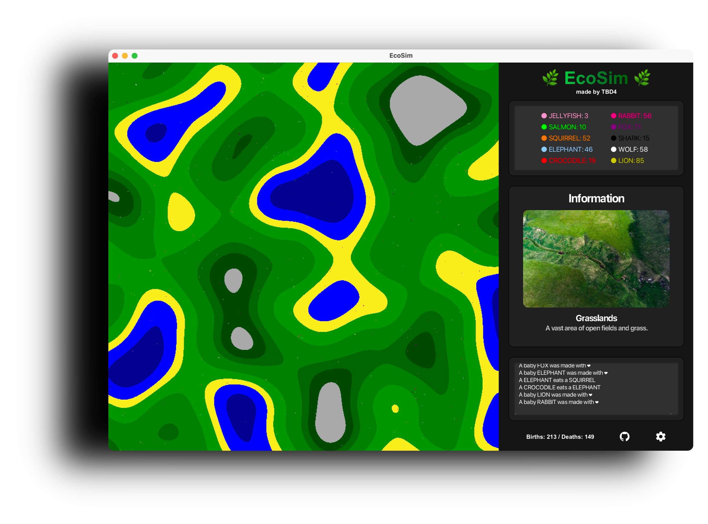

# EcoSim

🏆 **Best ML Project — BrisHack 2025**

EcoSim is a Java-based simulation developed during BrisHack 2025. It models ecological systems, allowing users to observe interactions within a virtual ecosystem.



## Prerequisites

- **Java Runtime Environment (JRE)**: Ensure you have Java installed. You can download it from the [official Oracle website](https://www.oracle.com/java/technologies/downloads/).

## Running the Application

To execute the EcoSim JAR file, download the pre-built JAR file from the [releases section](https://github.com/BRSY1/ecosim/releases):

**Using the Command Line**:
   - Open a terminal or command prompt.
   - Navigate to the directory containing `ecosim.jar`.
   - Run the following command:
     
     ```bash
     java -jar ecosim-1.0.0.jar
     ```
     
   - Ensure that the JAR file has execute permissions. If not, modify them using:
     
     ```bash
     chmod +x ecosim-1.0.0.jar
     ```
     
   - If double-clicking the JAR file doesn't launch the application, running it via the command line as shown above is recommended.

## Contributing

We welcome contributions! Please fork the repository and submit pull requests for any enhancements or bug fixes.

## License

This project is licensed under the MIT License. See the [LICENSE](LICENSE) file for details.
